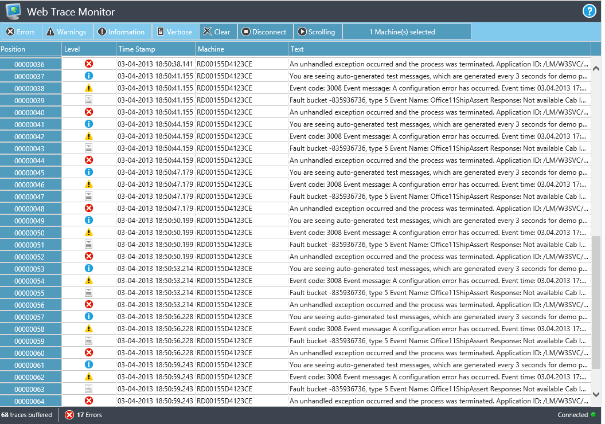

# Web Trace Monitor

Viewing realtime trace messages in modern browsers.

## Introduction

Web Trace Monitor is an open-source web application that can be installed on Windows Azure Websites, Windows Azure WebRoles or any other Windows Server running IIS and ASP.NET 4.5. 

It provides an unsecured, public REST endpoint, where trace messages can be posted to. For .NET developers a System.Diagnostics compatible trace listener exists for convenience. 

Web Trace Monitor uses [SignalR] to forward incoming trace messages to all connected browsers in near realtime.

Data is displayed with the means of the underlying [SlickGrid] and kept entirely in memory of the web browser until cleared. This enables quick filtering by machine or trace level. The usage of virtual Scrolling ensures, that web trace monitor can even deal with hundreds of thousands of trace messages.

The tool is targeted to gain insight into the process flow of complex distributed systems, like a Windows Azure application consisting of multiple roles, during development and testing. 

See a [Demo].  

## Release

The current release in the master branch is version 0.8.00 (BETA). Tested with latest versions of IE, Chrome, FireFox and Opera. 

## Installation

### Windows Azure Websites

The easiest way to deploy Web Trace Monitor is by publishing it directly from GitHub to a Windows Azure Website:

+ Create a Fork of the [master] branch on GitHub
+ Create a new WebSite with the Windows Azure Management Portal 
+ On the Dashboard of the Website in Azure click "Set up deployment from source control"
+ Choose GitHub and approve the authorization request.
+ Next you need to choose the Repository Name and branch. Choose your fork of the Web Trace Monitor.

The deployment is started automatically and after it has finished you should be able to access your instance of Web Trace Monitor.

### Windows Azure Web Role

+ Clone the repo
+ Open the solution with Visual Studio 2012
+ Publish the project WebTraceMonitor.Azure to your Windows Azure subscription
+ Make sure, your role is configured with exactly 1 instance. Multiple instances are not supported at the moment.

### Other IIS

+ Clone the repo
+ Open the solution with Visual Studio 2012
+ Publish the WebTraceMonitor web project e.g. with WebDeploy to IIS server. NOTE: web farms are not supported at the moment.

## Creating trace messages

Today there are two ways to send trace messages to Web Trace Monitor: REST API and System Diagnostics Trace Listener.

### REST API

Each instance of Web Trace Monitor creates a public REST endpoint at /api/trace. 

Example Http request header and body:

    POST
    http://webtracemonitordemo.azurewebsites.net/api/trace HTTP/1.1
    Content-type: application/json
    Host: webtracemonitordemo.azurewebsites.net
    Content-Length: 225
  
    { "Message": "Object reference not set to an instance of an object", "Level": "Error", "TimeStamp": "2013-04-05 17:53:00.000", "Machine":"R2D2", "Category":"Errors", "Source":"MyApplication", "ProcessId":765, "ThreadId":345 }
    

### System Diagnostics Trace Listener

.NET programmers can use the System Diagnostics Trace Listener that effectively wraps the REST API.

The _WebTraceMonitor.SystemDiagnosticsTraceListener.dll_ might be obtained by downloading and building the solution. 

To use it in your own project, reference the dll and add the following configuration to your app.config / web.config: 

    <system.diagnostics>
        <trace>
          <listeners>
            <add type="WebTraceMonitor.SystemDiagnosticsTraceListener.WebMonitorTraceListener, WebTraceMonitor.SystemDiagnosticsTraceListener" name="WebTraceMonitor" host="yoursite.azurewebsites.net" port="80">
              <filter type="" />
            </add>
          </listeners>
        </trace>
    </system.diagnostics>

Don´t forget to set _host_ and _port_ to your instance of Web Trace Monitor. 

Now all calls to _System.Diagnostics_ trace methods like _Trace.TraceInformation_, _Trace.TraceError_ etc. are sent to the Web Trace Monitor.

IMPORTANT NOTE: the trace listener is doing an asynchronous web request on each single trace-method call. If the remote server is not available, the trace message will be lost. Heavy tracing will result in heavy network activity. For these reasons it is not recommended to use this trace listener in production. 

## Contributions

If you find Web Trace Monitor useful and create other native Wrappers for the REST API, I would be happy to receive your PULL requests.

## License

[Apache License 2.0 (Apache)]

[SignalR]:http://signalr.net/
[SlickGrid]:https://github.com/mleibman/SlickGrid/
[Demo]:http://webtracemonitordemo.cloudapp.net/
[Apache License 2.0 (Apache)]:http://www.apache.org/licenses/LICENSE-2.0

